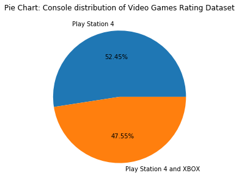
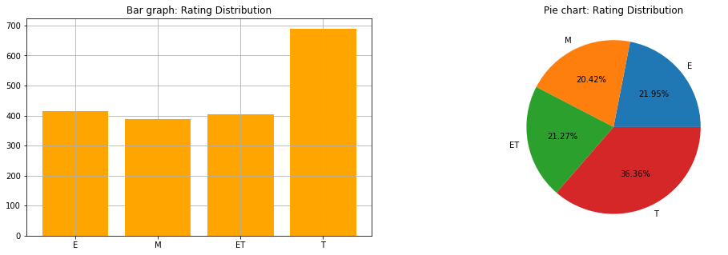
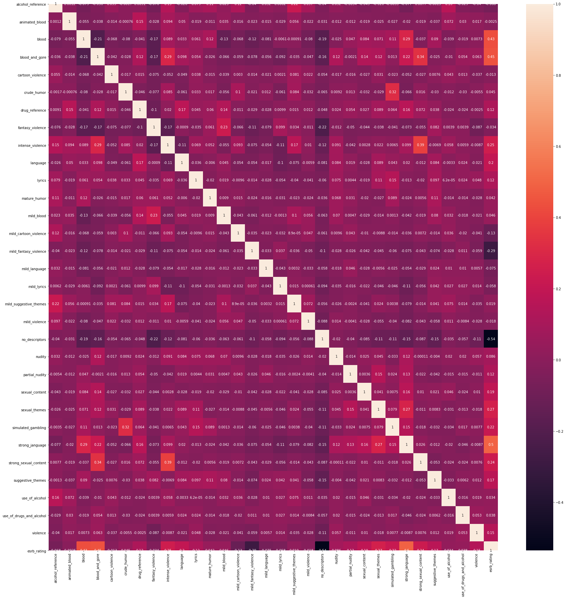
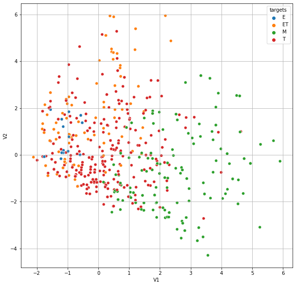

# Video Games Rating By 'ESRB'

This repository is a basic analysis and prediction on Video Games Ratings By 'ESRB'. Base on the dataset provided on [kaggle](https://www.kaggle.com/imohtn/video-games-rating-by-esrb). This project is aimed to provide a model that could predict ESRB ratings of video games based on various features. The code behind this article is documented at [simple code docs](./Code_docs.md).

## Video Games Dataset Description 

Video Games ESRB ratings dataset contains 1895 games with 34 of ESRB rating content with name for each game. Features of games included game console information, Alcohol, Blood content, violence and other rating sensitive content, which usually contribute to variance of final game rating. 

More detailed information on the dataset is listed as follows 

``` text 
<class 'pandas.core.frame.DataFrame'>
RangeIndex: 1895 entries, 0 to 1894
Data columns (total 34 columns):
title                       1895 non-null object
console                     1895 non-null int64
alcohol_reference           1895 non-null int64
animated_blood              1895 non-null int64
blood                       1895 non-null int64
blood_and_gore              1895 non-null int64
cartoon_violence            1895 non-null int64
crude_humor                 1895 non-null int64
drug_reference              1895 non-null int64
fantasy_violence            1895 non-null int64
intense_violence            1895 non-null int64
language                    1895 non-null int64
lyrics                      1895 non-null int64
mature_humor                1895 non-null int64
mild_blood                  1895 non-null int64
mild_cartoon_violence       1895 non-null int64
mild_fantasy_violence       1895 non-null int64
mild_language               1895 non-null int64
mild_lyrics                 1895 non-null int64
mild_suggestive_themes      1895 non-null int64
mild_violence               1895 non-null int64
no_descriptors              1895 non-null int64
nudity                      1895 non-null int64
partial_nudity              1895 non-null int64
sexual_content              1895 non-null int64
sexual_themes               1895 non-null int64
simulated_gambling          1895 non-null int64
strong_janguage             1895 non-null int64
strong_sexual_content       1895 non-null int64
suggestive_themes           1895 non-null int64
use_of_alcohol              1895 non-null int64
use_of_drugs_and_alcohol    1895 non-null int64
violence                    1895 non-null int64
esrb_rating                 1895 non-null object
dtypes: int64(32), object(2)
memory usage: 503.4+ KB
```

The above short description shed light on some characteristics of this dataset. There are 33 features of video game, except target variable, all of which are represented in binary ( 0 or 1 ) with meaning that certain feature presents in the game or not. `esrb_rating` is the target variable that we would like to predict: with `E` represent 'Everyone', `ET` represent 'Everyone 10+', `T` represent 'Teen' and `M` represent 'Mature'. The factors that impact ratings of video games are generally in several categories, blood, violence, language, drug, alcohol and sexual content. After an overview of dataset as a whole, data visualization will give us a deeper understanding of the dataset in next section. 

## Data Visualization 

In this section, I will focus on the visualization of the dataset.  

*Visualize Console Feature*

Let's take a look at the `console` variable. `console` indicate which game console/platform game is published, it give us a general image of games conditions in the dataset. Meanwhile, this feature might not directly contribut to game rating, there could be different game ratings on each platform.  

 

The pie chart above shows that there are mainly two types console in the dataset, `Play Station 4` and `Play Station 4 and XBOX`. Games on `Play Station 4` only exceeds a little than games published on both player station 4 and Xbox. There are not many platform varieties in the dataset. 


*Visualize Rating Distribution* 

Let's look at the target variable distribution, in both bar chart and pie chart. 



`Mature`, `Everyone` and `Everyone 10+` are distributed evenly while `Teen` rating composed of a slightly larger portion than other categories. 

*Correlations Map*

The Correlation Map will show which features are highly correlated with target variable. 

 

There are several features that are of high correlation with target variable, `blood` with value of `0.43`, `blood_and_gore` with value of `0.45`, `strong language` with value of `0.5`, `no_descriptors` with value of `-0.54`. Other highly correlated features are `sexual_themes` with value of `0.27`, `intense_violence` with value of `0.25`, `strong_sexual_content` with value of `0.24` and `simulated_gambling` with value of `0.22`, `mild_fantasy_violence` with value of `-0.29`. On the other hand, there are some features that is of smaller correlation with target variable, for instance `animated_blood` with value of `-0.0025`, `mild_violance` with value of `-0.018`, `cartoon_violance` of value of `0.013`. Those are variables that contribute to the dividen between mature and non-mature content. 

*Visualize Target Variable*

The problem is to classify video games into various rating categories, but is the target separatable? Using Principal Component Analysis, we could visualize the target variable to see if the variable could be cast to different dimentions and clusters.



Observed from the above graph, we could see that the target could be separate into different clusters when project to various vectors. Each rating category is represented in its own color and several clusters could be easily seen from the table. Classification algorithms could be performed in this case. 


## Classification Models 

There are several classification model that will be explored in this project. The dataset needs to be splitted into testing and training. `Random Forest Classifier`, `Decision Tree Classifier`, `Passive Aggressive Classifier`, `Ridge Classifier` and `K Neighbors Classificier`. There are 33 features for prediction, we apply features selection method to obtain a simpler model. 

*Random Forest* 

First we start with Random Forest prediction. The results is as follows: 
The features left are as follows ( features are represented in column indexes ).

``` text 
    [1, 3, 4, 5, 6, 7, 8, 9, 13, 14, 15, 16, 17, 18, 19, 20, 24, 25, 26, 28]  
```

And `Training Accurarcy` and `Testing Accurarcy` are as follows 

```text
    Training accuracy on selected features: 0.793
    Testing accuracy on selected features: 0.766
```

*Decision Tree Classifier* 

The decision tree classifier is also a common classifier. Most important features are 

```text 
    [1, 2, 3, 4, 5, 6, 8, 9, 10, 13, 16, 18, 19, 24, 25, 26, 27, 28, 29, 31] 
```

The training and testing accuracy are  

```text
    Training accuracy on selected features: 0.899
    Testing accuracy on selected features: 0.854
```

*Passive Aggressive Classifier*

The features selected by Passive Aggressive Classifier. 

```text
   [2, 3, 4, 8, 9, 11, 12, 13, 14, 15, 18, 20, 21, 23, 24, 25, 26, 27, 28, 29] 
```

Training and testing accuracy are present in the following 
```
    Training accuracy on selected features: 0.785
    Testing accuracy on selected features: 0.785     
```

*Ridge Classifier*

Results from Ridge Classifier is listed as follows. 

```text
    [0, 1, 2, 3, 4, 5, 7, 8, 9, 12, 14, 15, 20, 21, 22, 24, 25, 26, 28, 29]
```

Training and Testing accuracy. 
```text 
    Training accuracy on selected features: 0.785
    Testing accuracy on selected features: 0.776 
```

*K Neighbors Classifier*

Results from K Neighbors Classifier. 

```text 
    [8, 11, 12, 13, 14, 15, 16, 17, 19, 20, 21, 22, 23, 24, 26, 27, 28, 29, 30, 31]
    Training accuracy on selected features: 0.716
    Testing accuracy on selected features: 0.681
```

From the previous model analysis, among the models applied, Decision Tree give the best performance accuracy, given by highest training and testing accuracy. 

There are several features that present in all models, for instance `9 - intense violence`, `13 - mild_blood`, `14 - mild_catoon_violence`, `15 - mild_fantary_violence`, `24 - sexual_theme`, `26 - strong_language` and `28 - suggestive_themes`. Those features overlaps with some of features discovered in cross-validation process. 
